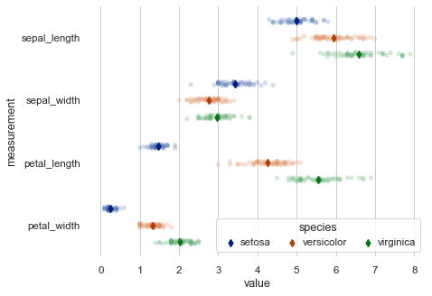

# Commodity Prices

This is a website to showcase our final project for FIN 377 - Data Science for Finance course at Lehigh University.

To see the complete analysis file(s) click [here](https://github.com/julioveracruz/testwebsite/blob/main/notebooks/example.ipynb).

Maybe you want a different website them for the project? Consider `minimal-mistakes`:
1. [Go here](https://github.com/mmistakes/mm-github-pages-starter/generate).
2. In the resulting repo, click Settings, then Pages, then make sure the source is the main branch.
3. [The doc site is here](https://mmistakes.github.io/minimal-mistakes/docs/structure/) and will help you customize layouts and figure out how to use it.

## Table of contents
1. [Introduction](#introduction)
2. [Research Question](#meth)
3. [Data](#section2)
4. [Project Considerations](#other)
5. [Summary](#summary)

## Introduction  <a name="introduction"></a>

The main goal of this project is to explore whether it is possible to predict the price of various agricultural commodities (corn, wheat, and soybeans) by using machine learning techniques on macroeconomic, weather, and financial datasets.  

## Research Question <a name="meth"></a>

#### Can climate and macroeconomic indicators be used to predict the domestic prices of Corn, Wheat, and Soybeans?
### Sub Questions (specific research questions): 
- Are macroeconomic data correlated with climate data? 
- Which commodities are most easily predicted? 
- Are there arbitrage opportunities within the futures market? 

## Data <a name="section2"></a>
### Commodities
- Corn
- Wheat
- Soybeans

### Climate Data
- Domestic data only
- Precipitation
- Snowfall
- Max Temperature
- Min Temperature
- Collected in McLean, IL; Whitman, WA; and Cass, ND
- Data collected from https://www.ncdc.noaa.gov/

### Macroeconomic Data
- Unemployment
- Inflation (CPI)
- Interest Rates 
- GDP
- Consumer Sentiment (CCI)
- S&P500 Index Returns, converted to monthly observations
- Data collected from FRED, and investing.com. 

All data was relatively clean with few errors.

## Project Considerations <a name="other"></a>
- **Observation:** Time-Commodity 
- **Sample period:** 1990-2019
- **Financial Theory:** Empirical research has found that found positive historical returns together with low or even slightly negative equity-commodity correlations and positive inflation-commodity correlations. This model may help exploit this arbritrage opportunity.

### Subsection 2 <a name="subsec2-2"></a>
This is a subsection, formatted in heading 3 style

## Analysis Section <a name="section3"></a>

Here are some graphs that we created in our analysis. We saved them to the `pics/` subfolder and include them via the usual markdown syntax for pictures.


<br><br>
Some analysis here
<br><br>

<br><br>
More analysis here.
<br><br>

<br><br>
More analysis.

## Summary <a name="summary"></a>

Blah blah 


```python
import seaborn as sns 
iris = sns.load_dataset('iris') 

print(iris.head(),  '\n---')
print(iris.tail(),  '\n---')
print(iris.columns, '\n---')
print("The shape is: ",iris.shape, '\n---')
print("Info:",iris.info(), '\n---') # memory usage, name, dtype, and # of non-null obs (--> # of missing obs) per variable
print(iris.describe(), '\n---') # summary stats, and you can customize the list!
print(iris['species'].value_counts()[:10], '\n---')
print(iris['species'].nunique(), '\n---')
```
## About the team


<br>
Michael Rich is a Financial Engineering major in Lehigh University's IBE program. He can be reached at mbr223@lehigh.edu.
<br><br><br>

<br>
Alex Outkou is a Finance and Business Information Systems double major at Lehigh University. He can be reached at ado323@lehigh.edu.
<br><br><br>

<br>
Luke Costello is pursuing a degree in Finance at Lehigh University. He can be reached at lrc224@lehigh.edu
<br><br><br>

<br>
Harry Herman is a Finance major at Lehigh University. He can be reached at hsh423@lehigh.edu.


## More 

To view the GitHub repo for this website, click [here](https://github.com/donbowen/teamproject).
