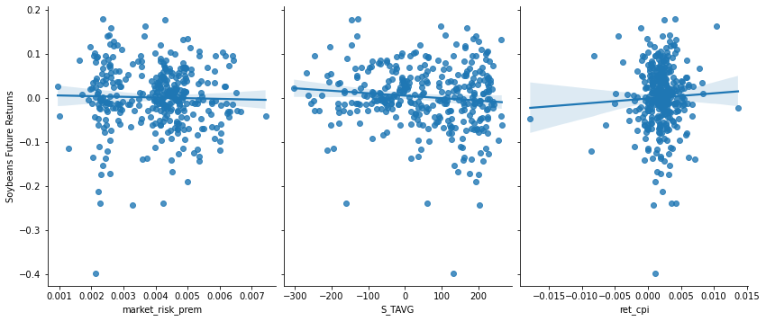

# Commodity Prices

This is a website to showcase our final project for FIN 377 - Data Science for Finance course at Lehigh University.

To see the complete analysis file(s) click [here](https://github.com/julioveracruz/testwebsite/blob/main/notebooks/example.ipynb).

Maybe you want a different website them for the project? Consider `minimal-mistakes`:
1. [Go here](https://github.com/mmistakes/mm-github-pages-starter/generate).
2. In the resulting repo, click Settings, then Pages, then make sure the source is the main branch.
3. [The doc site is here](https://mmistakes.github.io/minimal-mistakes/docs/structure/) and will help you customize layouts and figure out how to use it.

## Table of contents
1. [Introduction](#introduction)
2. [Research Question](#meth)
3. [Data](#section2)
4. [Project Considerations](#other)
5. [Data Cleaning](#cleaning)
6. [Predictive Modeling](#modeling)

## Introduction  <a name="introduction"></a>

The main goal of this project is to explore whether it is possible to predict the price of various agricultural commodities (corn, wheat, and soybeans) by using machine learning techniques on macroeconomic, weather, and financial datasets.  

## Research Question <a name="meth"></a>

#### Can climate and macroeconomic indicators be used to predict the future domestic returns of Corn, Wheat, and Soybeans? Can we use historical data to create a model that "beats the market" by finding arbitrage opportunity, or does the Efficient Market Hypothesis hold?

## Data <a name="section2"></a>
### Commodities
- [Corn](https://www.investing.com/commodities/us-corn-historical-data)
- [Wheat](https://www.investing.com/commodities/us-wheat-historical-data)
- [Soybeans](https://www.investing.com/commodities/us-soybeans-historical-data)


### Climate Data
- Domestic data only
- Precipitation
- Snowfall
- Maximum Temperature
- Minimum Temperature
- Collected in McLean, IL; Whitman, WA; and Cass, ND
- Data collected from https://www.ncdc.noaa.gov/

### Macroeconomic Data
- [Unemployment](https://fred.stlouisfed.org/series/UNRATE)
- [Inflation (CPI)](https://fred.stlouisfed.org/series/CPIAUCSL)
- [Interest Rates](https://fred.stlouisfed.org/searchresults?st=interest)
- [GDP](https://fred.stlouisfed.org/series/GDP)
- [S&P500 Index Returns](https://www.investing.com/indices/us-spx-500-historical-data)

pandas_datareader was used to scrape most of our macroeconomic data. A sample of the code is below.

``` python
start = datetime.datetime(1990, 1, 1) 
end = datetime.datetime(2020, 1, 1)

macro_df = pdr.data.DataReader(['GDP','CPIAUCSL','UNRATE'], 'fred', start, end)
```

## Project Considerations <a name="other"></a>
- **Observation:** Time-Commodity 
- **Sample period:** 1990-2019
- **Financial Theory:** Empirical research has found that found positive historical returns together with low or even slightly negative equity-commodity correlations and positive inflation-commodity correlations. This model may help exploit this arbritrage opportunity. However, the Efficient Market Hypothesis holds that asset prices reflect all available information - eliminating arbitrage opportunities. The predictive data the is being gathered is widely available and commodities are traded continuously at large volumes.

## Data Cleaning <a name="cleaning"></a>
Data was cleaned in this [file](https://github.com/lukecost/CommodityPrices/blob/main/data_cleaning.ipynb).

#### Points of Interest
- GDP is computed quarterly, so the 'nearest' method is used to fill in missing DSP data.
- Commodity price and climate data are merged with macroeconomic data to create one DataFrame.
- Commodity prices translated float types, then used to calculate returns. **A sample of this is below.**


Unnecessary columns are removed, common timeframes are implimented, and a final DataFrame is created by merging all cleaned data. Cleaned data is exported to a CSV file for reusability.

``` python
Commodities_Final['realized_ret_corn'] = (np.log(Commodities_Final['Corn_Future_Price'].shift(-1)) 
                                       - np.log(Commodities_Final['Corn_Future_Price']))
                                       
```

## Regression
The file containing regressions on our data can be found [here](https://github.com/lukecost/CommodityPrices/blob/main/part1_regressions.ipynb)

The goal of using regression on our data is to gain an initial understanding of the degree of correlation between the various independent variable in our dataset and the explanatory variables (returns of commodity futures). 

These regressions examine the relationship between commodity returns the data described above.

#### Market Risk Premium Varibale
- Computed the monthly returns for the sp500
- Used the .rolling() function to compute a rolling, 60 month period average of the s&p 500 returns.
- Calculated estimates for the market risk premium for each observation in our dataset by subtracting a monthly risk free - rate (0.407%) from our s&p 500 returns
- Used a weighted average to ensure positive market risk premiums
- This variable is crucial for the regressions.

With all variables loaded in, the StatsModels library and API are used for regressions. **Code and analysis for regressions is below**. 

*Corn Regressions* 
 
- **Model 1**: ``` corn1 = sm_ols('realized_ret_corn ~ (market_risk_prem)',data=Commodities_DF).fit() ```
     - Key Statistics: 
     | Statistic      | Value |
| ----------- | ----------- |
| R^2      | 0.000       |
| β1 (market_risk_prem)  | 0.355        |
     - Interpretation: 
         - β1 : A single % increase in the market risk premium is associated with a 0.355% increase in corn future returns, on average


- **Model 2**: ``` corn2 = sm_ols('realized_ret_corn ~ market_risk_prem + ret_gdp + ret_cpi + UNRATE + sp500_rets', data=Commodities_DF).fit() ```
    - Key Statistics: 
     | Statistic      | Value |
| ----------- | ----------- |
| R^2      | 0.035       |
| β1 (market_risk_prem)  | -1.078        |
| β2 (ret_gdp)  | 0.0187        |
| β3 (ret_cpi)  | -0.394       |
| β4 (UNRATE)  | 0.000082        |
| β5 (sp500_rets)  | 0.365        |
    - Interpretation: 
         - β1 : A single % increase in the market risk premium is associated with a 1.078% decrease in corn future returns, on average (ceteris paribus)
         - β2: A single % increase in US GDP is associated with with a 0.018% increase in corn future returns, on average (ceteris paribus)
         - β3: A single % increase in US CPI (inflation) is associated with a 0.394% decrease in corn future returns, on average (ceteris paribus)
         - β4: A single % increase in US unemployment rates is associated with a 0.000082% increase in corn future returns, on average (ceteris paribus)
         - β5: A single % increase in SP500 returns is associated with a 0.365% increase in corn future returns, on average (ceteris paribus)


- **Model 3**: ```sm_ols('realized_ret_corn ~ market_risk_prem + ret_gdp + ret_cpi + UNRATE + sp500_rets + C_PRCP + C_SNOW + C_TMAX + C_TMIN', data=Commodities_DF).fit()```
  - Key Statistics: 
     | Statistic      | Value |
| ----------- | ----------- |
| R^2      | 0.061       |
| β1 (market_risk_prem)  | -0.2383        |
| β2 (ret_gdp)  | 0.1622        |
| β3 (ret_cpi)  | -0.7320       |
| β4 (UNRATE)  | 0.0014        |
| β5 (sp500_rets)  | 0.3448	        |
| β6 (C_PRCP)  | 0.000063    |
| β7 (C_SNOW)  | -0.0003       |
| β8 (C_TMAX)  | 0.000075	        |
| β9 (C_TMIN)  | 0.000002        |
    - Interpretation: 
         - β1 : A single % increase in the market risk premium is associated with a -0.2383 decrease in corn future returns, on average (ceteris paribus)
         - β2: A single % increase in US GDP is associated with with a 0.1622% increase in corn future returns, on average (ceteris paribus)
         - β3: A single % increase in US CPI (inflation) is associated with a -0.7320% decrease in corn future returns, on average (ceteris paribus)
         - β4: A single % increase in US unemployment rates is associated with a 0.0014% increase in corn future returns, on average (ceteris paribus)
         - β5: A single % increase in SP500 returns is associated with a 0.3448% increase in corn future returns, on average (ceteris paribus)
         - β6: A single unit increase in precipitation is associated with a 0.000063% increase in corn future returns, on average (ceteris paribus)
         - β7: A single unit increase in snowfall is associated with a -0.0003 increase in corn future returns, on average (ceteris paribus)
         - β8: A single unit increase in max temperatures is associated with a 0.000075% increase in corn future returns, on average (ceteris paribus)
         - β9: A single unit increase in min temperatures is associated with a 0.000002% increase in corn future returns, on average (ceteris paribus)
     
         
*Soybeans Regressions* 
 
- **Model 1**: ``` sm_ols('realized_ret_soybeans ~ (market_risk_prem)',data=Commodities_DF).fit() ```
     - Key Statistics: 
     | Statistic      | Value |
| ----------- | ----------- |
| R^2      | 0.001       |
| β1 (market_risk_prem)  | -1.556        |
     - Interpretation: 
         - β1 : A single % increase in the market risk premium is associated with a 1.556% decrease in soybeans future returns, on average


- **Model 2**: ``` sm_ols('realized_ret_soybeans ~ market_risk_prem + ret_gdp + ret_cpi + UNRATE + sp500_rets', data=Commodities_DF).fit() ```
    - Key Statistics: 
     | Statistic      | Value |
| ----------- | ----------- |
| R^2      | 0.049       |
| β1 (market_risk_prem)  | -2.9067        |
| β2 (ret_gdp)  | -0.5800        |
| β3 (ret_cpi)  | 1.2068       |
| β4 (UNRATE)  | 0.0000086        |
| β5 (sp500_rets)  | 0.371        |
    - Interpretation: 
         - β1 : A single % increase in the market risk premium is associated with a 2.907% decrease in soybeans future returns, on average (ceteris paribus)
         - β2: A single % increase in US GDP is associated with with a 0.580% decrease in soybeans future returns, on average (ceteris paribus)
         - β3: A single % increase in US CPI (inflation) is associated with a 1.207% decrease in soybeans future returns, on average (ceteris paribus)
         - β4: A single % increase in US unemployment rates is associated with a 0.000009% increase in soybeans future returns, on average (ceteris paribus)
         - β5: A single % increase in SP500 returns is associated with a 0.371% increase in soybeans future returns, on average (ceteris paribus)


- **Model 3**: ```sm_ols('realized_ret_corn ~ market_risk_prem + ret_gdp + ret_cpi + UNRATE + sp500_rets + C_PRCP + C_SNOW + C_TMAX + C_TMIN', data=Commodities_DF).fit()```
  - Key Statistics: 
     | Statistic      | Value |
| ----------- | ----------- |
| R^2      | 0.060       |
| β1 (market_risk_prem)  | -2.9791        |
| β2 (ret_gdp)  | -0.6377        |
| β3 (ret_cpi)  | 0.7117      |
| β4 (UNRATE)  | 0.0005        |
| β5 (sp500_rets)  | 0.3819	        |
| β6 (S_PRCP)  | 0.0000038    |
| β7 (S_SNOW)  | -0.0000038       |
| β8 (S_TMAX)  | 0.000028	        |
| β9 (S_TMIN)  | 0.000023        |
    - Interpretation: 
         - β1 : A single % increase in the market risk premium is associated with a 2.979 decrease in soybeans future returns, on average (ceteris paribus)
         - β2: A single % increase in US GDP is associated with with a 0.6377% decrease in soybeans future returns, on average (ceteris paribus)
         - β3: A single % increase in US CPI (inflation) is associated with a  0.7117% increase in soybeans future returns, on average (ceteris paribus)
         - β4: A single % increase in US unemployment rates is associated with a 0.0005% increase in soybeans future returns, on average (ceteris paribus)
         - β5: A single % increase in SP500 returns is associated with a 0.3819% increase in soybeans future returns, on average (ceteris paribus)
         - β6: A single unit increase in precipitation is associated with a 0.0000038% increase in soybeans future returns, on average (ceteris paribus)
         - β7: A single unit increase in snowfall is associated with a 0.0000038 decrease in soybeans future returns, on average (ceteris paribus)
         - β8: A single unit increase in max temperatures is associated with a 0.000028% increase in soybeans future returns, on average (ceteris paribus)
         - β9: A single unit increase in min temperatures is associated with a 0.000023% increase in soybeans future returns, on average (ceteris paribus)
 
 
*Wheat Regressions* 
 
- **Model 1**: ``` sm_ols('realized_ret_wheat ~ (market_risk_prem)',data=Commodities_DF).fit() ```
     - Key Statistics: 
     | Statistic      | Value |
| ----------- | ----------- |
| R^2      | 0.000       |
| β1 (market_risk_prem)  | -0.7131        |
     - Interpretation: 
         - β1 : A single % increase in the market risk premium is associated with a 0.713% decrease in wheat future returns, on average


- **Model 2**: ``` sm_ols('realized_ret_wheat ~ market_risk_prem + ret_gdp + ret_cpi + UNRATE + sp500_rets', data=Commodities_DF).fit() ```
    - Key Statistics: 
     | Statistic      | Value |
| ----------- | ----------- |
| R^2      | 0.031       |
| β1 (market_risk_prem)  | -3.2112        |
| β2 (ret_gdp)  | 0.3436        |
| β3 (ret_cpi)  | 0.2033       |
| β4 (UNRATE)  | -0.0015        |
| β5 (sp500_rets)  | 0.3585       |
    - Interpretation: 
         - β1 : A single % increase in the market risk premium is associated with a 3.211% decrease in wheat future returns, on average (ceteris paribus)
         - β2: A single % increase in US GDP is associated with with a 0.344% increase in wheat future returns, on average (ceteris paribus)
         - β3: A single % increase in US CPI (inflation) is associated with a 0.203% increase in wheat future returns, on average (ceteris paribus)
         - β4: A single % increase in US unemployment rates is associated with a 0.0015% decrease in wheat future returns, on average (ceteris paribus)
         - β5: A single % increase in SP500 returns is associated with a 0.358% increase in wheat future returns, on average (ceteris paribus)


- **Model 3**: ```sm_ols('realized_ret_wheat ~ market_risk_prem + ret_gdp + ret_cpi + UNRATE + sp500_rets + W_PRCP + W_SNOW + W_TMAX + W_TMIN' ,data=Commodities_DF).fit()```
  - Key Statistics: 
     | Statistic      | Value |
| ----------- | ----------- |
| R^2      | 0.067       |
| β1 (market_risk_prem)  | -1.8263        |
| β2 (ret_gdp)  | 0.9930       |
| β3 (ret_cpi)  | -1.0529      |
| β4 (UNRATE)  | -0.0007       |
| β5 (sp500_rets)  | 0.3789        |
| β6 (S_PRCP)  | -0.0000024    |
| β7 (S_SNOW)  | -0.0002       |
| β8 (S_TMAX)  | 0.0000037	        |
| β9 (S_TMIN)  | 0.0002        |
    - Interpretation: 
         - β1 : A single % increase in the market risk premium is associated with a 1.8263 decrease in wheat future returns, on average (ceteris paribus)
         - β2: A single % increase in US GDP is associated with with a 0.993% increase in wheat future returns, on average (ceteris paribus)
         - β3: A single % increase in US CPI (inflation) is associated with a  1.0529% decrease in wheat future returns, on average (ceteris paribus)
         - β4: A single % increase in US unemployment rates is associated with a 0.0007% decrease in wheat future returns, on average (ceteris paribus)
         - β5: A single % increase in SP500 returns is associated with a 0.3789% increase in wheat future returns, on average (ceteris paribus)
         - β6: A single unit increase in precipitation is associated with a 0.0000024% decrease in wheat future returns, on average (ceteris paribus)
         - β7: A single unit increase in snowfall is associated with a 0.0002 decrease in wheat future returns, on average (ceteris paribus)
         - β8: A single unit increase in max temperatures is associated with a 0.0000037% increase in wheat future returns, on average (ceteris paribus)
         - β9: A single unit increase in min temperatures is associated with a 0.0002% increase in wheat future returns, on average (ceteris paribus)

**Analysis of regressions**
- Regressions got better as more independent variables as added. Model 3 had the highest R2 among all commodities.
- Macroeconomic and climate variables DO help predict variations in futures returns.
- Climate coefficients are generally very close to zero, indicating that they are very weakly correlated to returns.
- The signs of these coefficients do make sense, however, as one would expect more precipitation to have a positive impact on crop returns, while the opposite would be the expectation for snowfall. 
- The coefficient of the market risk premium went from being positive to strongly negative (for corn and soybeans) as other variables were added. This coefficient is essentially an estimate of the financial beta of these futures, so a negative beta is the logical expectation, given that equity and commodity market tend to move in opposite directions.
- Most of coefficients observed for all models have a low likelihood to be truly statistically significant, as only a handful of them have a t-score above the threshold value of 1.96. 

**Visualizing Regression Relationships**
 - Visualization 1: Monthly Corn Futures Returns vs Select Independent Variables


 - Visualization 2: Monthly Soybeans Futures Returns vs Select Independent Variables



 - Visualization 3: Monthly Wheat Futures Returns vs Select Independent Variables
 


- Visualization 4: Heatmap of variables in the corn dataset.


## Predictive Modeling <a name="modeling"></a>
We separated the data to create training and holdout sets. The training set would be used to train the model, whereas the holdout set would be used to test the accuracy of our trained model. Data from years 1990 - 2014 (80%) was used as the training data to create a model for our testing data consisting of years 2015-2019 (20%). 

X variables (independent) are separated from the y variable (dependent) for the model. In this case, commodity returns are the dependent variable.


## Summary <a name="summary"></a>

Blah blah 


```python
import seaborn as sns 
iris = sns.load_dataset('iris') 

print(iris.head(),  '\n---')
print(iris.tail(),  '\n---')
print(iris.columns, '\n---')
print("The shape is: ",iris.shape, '\n---')
print("Info:",iris.info(), '\n---') # memory usage, name, dtype, and # of non-null obs (--> # of missing obs) per variable
print(iris.describe(), '\n---') # summary stats, and you can customize the list!
print(iris['species'].value_counts()[:10], '\n---')
print(iris['species'].nunique(), '\n---')
```
## About the team


<br>
Michael Rich is a Financial Engineering major in Lehigh University's IBE program. He can be reached at mbr223@lehigh.edu.
<br><br><br>

<br>
Alex Outkou is a Finance and Business Information Systems double major at Lehigh University. He can be reached at ado323@lehigh.edu.
<br><br><br>

<br>
Luke Costello is pursuing a degree in Finance at Lehigh University. He can be reached at lrc224@lehigh.edu
<br><br><br>

<br>
Harry Herman is a Finance major at Lehigh University. He can be reached at hsh423@lehigh.edu.


## More 

To view the GitHub repo for this website, click [here](https://github.com/donbowen/teamproject).
